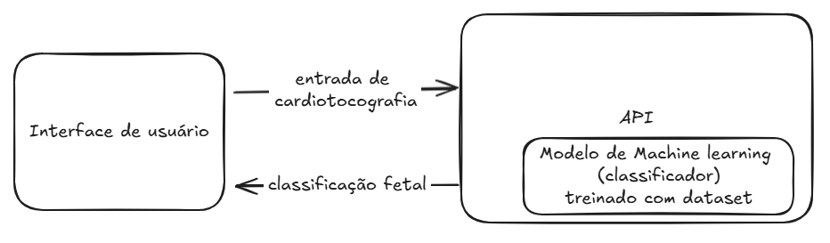

# Classifição de estado de saúde fetal

Este projeto consiste em um MVP de um sistema de classificação do estado de saúde fetal baseado em dados de cardiotocografia. A classificação é realizada utilizando-se um modelo de árvore de decisão com dados padronizados. O modelo foi treinado com base em dados de 2126 pacientes, o dataset está disponível em https://www.kaggle.com/datasets/andrewmvd/fetal-health-classification/data.

O projeto está organizado nos seguintes diretórios:

- `api`: API RESTful para classificação do estado de saúde fetal. Veja o [README](api/README.md) para mais informações.
- `dataset`: Dataset utilizado para treinamento do modelo
- `frontend`: Frontend para interação com a API

Esta imagem demonstra como os componentes interagem entre si:

## Entradas

Os dados de entrada (provenientes da cardiotocografia) são:

- **baseline value**: Frequência cardíaca basal do feto em Batimentos Por Minuto (BPM)
- **accelerations**: Número de acelerações por segundo
- **fetal_movement**: Número de movimentos fetais por segundo
- **uterine_contractions**: Número de contrações uterinas por segundo
- **light_decelerations**: Número de desacelerações leves por segundo
- **severe_decelerations**: Número de desacelerações severas por segundo
- **prolongued_decelerations**: Número de desacelerações prolongadas por segundo
- **abnormal_short_term_variability**: Percentual de tempo com variabilidade de curto prazo\* anormal
- **mean_value_of_short_term_variability**: Valor médio da variabilidade de curto prazo
- **percentage_of_time_with_abnormal_long_term_variability**: Percentual de tempo com variabilidade de longo prazo\*\* anormal
- **mean_value_of_long_term_variability**: Valor médio da variabilidade de longo prazo
- **histogram_width**: largura do histograma de frequência cardíaca fetal
- **histogram_min**: Valor mínimo do histograma de frequência cardíaca fetal
- **histogram_max**: Valor máximo do histograma de frequência cardíaca fetal
- **histogram_number_of_peaks**: Número de picos no histograma de frequência cardíaca fetal
- **histogram_number_of_zeroes**: Número de zeros no histograma de frequência cardíaca fetal
- **histogram_mode**: Moda do histograma de frequência cardíaca fetal
- **histogram_mean**: Média do histograma de frequência cardíaca fetal
- **histogram_median**: Mediana do histograma de frequência cardíaca fetal
- **histogram_variance**: Variância do histograma de frequência cardíaca fetal
- **histogram_tendency**: Tendência do histograma de frequência cardíaca fetal

\* Variabilidade de curto prazo: A variabilidade de curto prazo (em ms) corresponde à média das diferenças dos valores da Frequência Cardíaca Fetal (FCF) entre períodos adjacentes de 3,75 segundos

\*\* Variabilidade de longo prazo: A variabilidade de longo prazo (em ms) corresponde à diferenças dos valores máximo e mínimo da FCF entre o período de 1 minuto

## Saída

O estado de saúde fetal é classificado em 3 categorias:

- fetal_health = 1: Normal
- fetal_health = 2: Suspeito
- fetal_health = 3: Patológico
